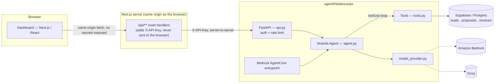

# FreelanceOps Agent

Built for the AWS **Agents for Humans** hackathon — Professional Agents track.

An agent that handles the repetitive, judgment-heavy admin work of running a
one-person freelance dev shop: drafting tailored proposals, chasing quiet
leads, and reminding clients about overdue invoices. It runs in the
background and only surfaces when a real decision is needed — not another
dashboard to babysit.

## The problem

Every freelancer loses hours a week to the same three tasks: writing a
proposal that isn't generic, remembering which leads have gone quiet, and
sending invoice reminders without sounding like a collections agency. None of
it is hard — it's just repetitive and easy to let slide, and letting it slide
directly costs income.

## Who it's for

Solo freelancers and small dev/design/marketing shops running client work
through Upwork or direct contracts — starting with my own studio, Alif Dev
Studio.

## What it does

A [Strands Agents](https://strandsagents.com) agent with four tools:

| Tool | What it does |
|---|---|
| `draft_proposal` | Reads a job post, matches it against real past projects, drafts a tailored proposal, saves it |
| `check_followups` | Queries live leads for anyone gone quiet 4+ days |
| `draft_followup` | Writes a follow-up for one specific lead, grounded in its real history |
| `invoice_reminder` | Drafts payment reminders for real overdue, unpaid invoices |

The agent decides which tools to call and in what order — "check my leads and
draft follow-ups for anything pending" triggers `check_followups`, then
`draft_followup` once per flagged lead, with no hardcoded orchestration logic.
That decision loop is the actual agentic part; the tools are just grounded
capabilities it can reach for.

### Model provider

The agent talks to its model through a single `build_model()` call
(`agent/freelanceops/model_provider.py`), switched by one environment
variable — `MODEL_PROVIDER=bedrock` (Amazon Bedrock, Claude/Nova) or
`MODEL_PROVIDER=groq` (Groq's OpenAI-compatible API). Strands' tool-calling
loop, the four tools, and the dashboard are unchanged either way — only the
model backend changes. Per the [official hackathon
rules](https://agentsforhumans.devpost.com/rules), deploying on Amazon
Bedrock AgentCore strengthens the Technical Implementation score but isn't
required; a submission built with Strands Agents and a different model host
stays fully eligible.

## Architecture



- **`agent/freelanceops/agent.py`** — builds the Strands `Agent`, system
  prompt, and model (via `model_provider.py`).
- **`agent/freelanceops/model_provider.py`** — returns a Bedrock or Groq
  model instance based on `MODEL_PROVIDER`.
- **`agent/freelanceops/tools.py`** — the four `@tool`-decorated functions.
  Each docstring is what the model reads to decide *when* to call it.
- **`agent/freelanceops/db.py`** — the only file that talks to Supabase.
  Tools stay thin; all data access is here.
- **`agent/freelanceops/api.py`** — FastAPI wrapper: API-key auth, per-IP
  rate limiting, and input length limits sit here, in front of the agent.
- **`agent/freelanceops/agentcore_app.py`** — the same agent wrapped for
  deployment on **Amazon Bedrock AgentCore**.
- **`app/api/**/route.ts`** — Next.js server routes that proxy the browser's
  requests to FastAPI, attaching the shared API key server-side. The browser
  never holds a backend URL or secret.
- **`app/page.tsx`** — the dashboard: a free-text agent console plus a
  proposal drafter and a live leads/invoices panel.

### Security notes

- **Password-gated dashboard** (`DASHBOARD_PASSWORD`) — the whole app sits
  behind a lightweight password check (`middleware.ts`), so a public deploy
  URL can't be used or quota-drained by strangers who find the link.
- **No direct browser to backend calls.** The dashboard only calls its own
  origin (`/api/*`); a Next.js server route forwards to FastAPI with a
  shared secret attached server-side.
- **API-key auth** (`AGENT_API_KEY`) on every FastAPI route except
  `/api/health`.
- **Per-IP rate limiting** (default 20 req/min) on the FastAPI layer, to
  protect the model/DB quota from abuse.
- **CORS closed by default**; only the origins listed in `ALLOWED_ORIGINS`
  can call FastAPI directly.
- **Input length limits** on every free-text field (Pydantic `max_length`).
- **Sanitized lookups** — user-provided names are stripped of PostgREST
  filter-syntax characters before being used in a query.
- Secrets (`AWS_*`, `SUPABASE_SERVICE_ROLE_KEY`, `GROQ_API_KEY`,
  `AGENT_API_KEY`) only ever live in `.env` files, which are gitignored.

## Setup

### 1. Backend (agent)

```bash
cd agent
python -m venv .venv && source .venv/bin/activate   # Windows: .venv\Scripts\Activate.ps1
pip install -r requirements.txt
cp .env.example .env
```

Fill in `agent/.env`:
- Supabase: `SUPABASE_URL`, `SUPABASE_SERVICE_ROLE_KEY`
- `AGENT_API_KEY` — any random string (`openssl rand -hex 32`); must match
  the root `.env.local`
- Model provider — either:
  - `MODEL_PROVIDER=groq`, `GROQ_API_KEY` (free key at
    console.groq.com/keys), `GROQ_MODEL_ID`
  - or `MODEL_PROVIDER=bedrock`, AWS credentials, `BEDROCK_MODEL_ID`
    (requires Bedrock model access in your AWS account/region)

Run `schema.sql` in your Supabase project's SQL editor to create the
`leads`, `proposals`, and `invoices` tables.

```bash
# CLI (single request)
python -m freelanceops.agent "Draft a proposal for: <paste job post>"

# HTTP API for the dashboard
uvicorn freelanceops.api:app --reload --port 8787
```

### 2. Frontend (dashboard)

```bash
npm install
cp .env.example .env.local
npm run dev
```

Fill in `.env.local` (root): `AGENT_API_URL=http://localhost:8787`, the
same `AGENT_API_KEY` as `agent/.env`, and `DASHBOARD_PASSWORD` (any string —
this gates the whole dashboard; leave unset to disable locally). All three
are server-only — Next.js never sends them to the browser.

### 3. Deploy to Bedrock AgentCore (optional production path)

```bash
cd agent
pip install bedrock-agentcore bedrock-agentcore-starter-toolkit
agentcore configure --entrypoint freelanceops/agentcore_app.py
agentcore launch
```

This provisions the agent on managed AWS infrastructure. Point
`AGENT_API_URL` at the resulting endpoint, or keep the FastAPI service as the
demo backend — both paths call the same `build_agent()`.

## Built with

Strands Agents SDK, Groq / Amazon Bedrock, Amazon Bedrock AgentCore,
FastAPI, Supabase (Postgres), Next.js (App Router), React, TypeScript,
Tailwind CSS

## What's next

Multi-user support (right now it's single-operator), Gmail/Upwork API
integration so leads and invoices populate automatically instead of manual
entry, and a scheduled daily run instead of on-demand.

## License

MIT — see [LICENSE](./LICENSE).
